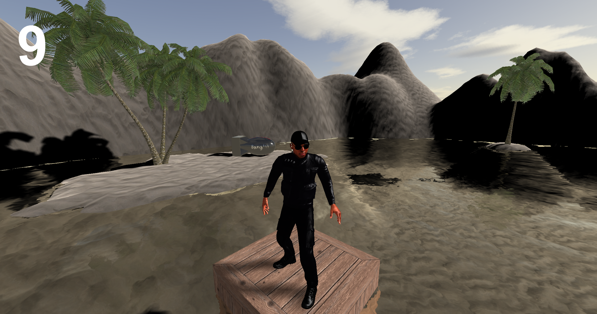
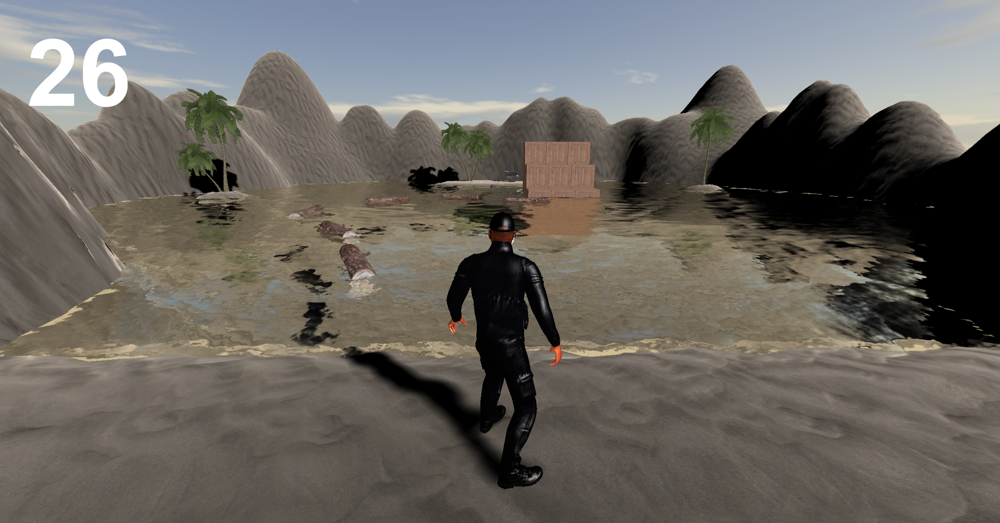

NUKE RUN - a 3D platformer for the web!

[screen-capture.webm](https://user-images.githubusercontent.com/22895877/177047619-a59dcc0e-c360-41e0-9ae1-096401b1d9c9.webm)

(audio is out of sync due to recording issues. The actual game doesn't have this problem I promise!)

Setup:
Run server.py using command: python ./server.py
You may need to use: python3 ./server.py
To play the game navigate to http://localhost:8000/Solution/ in your favourite web browser
(The game was tested on google chrome)

Some UI elements may appear too big (e.g. the back button on the How To Play screen)
Hold down ctrl and scroll back to change the UI and menu to the desired size.
The UI size has been tested to work on a 1080p screen, you should only encounter issues on
lower resolution screens.

One tip: run into the nuke to push it into the water!
